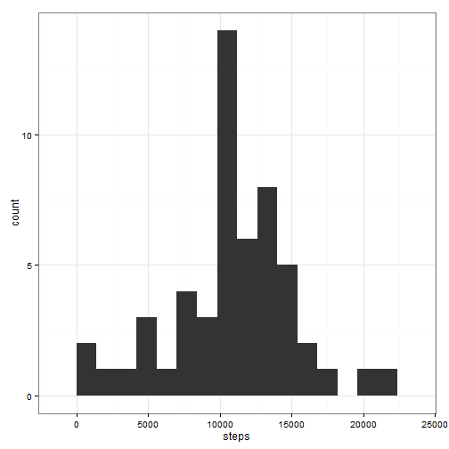
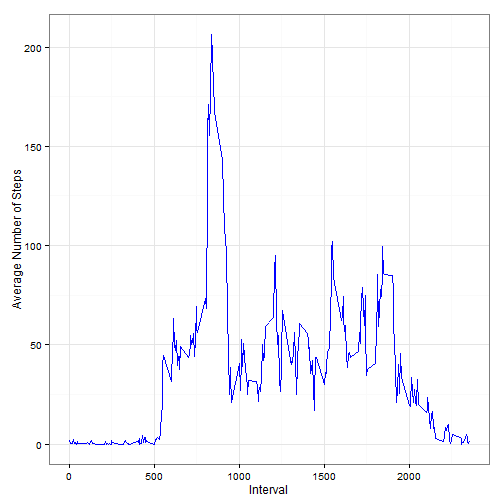
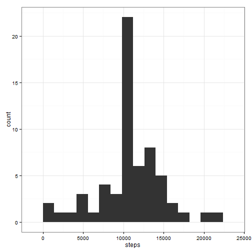
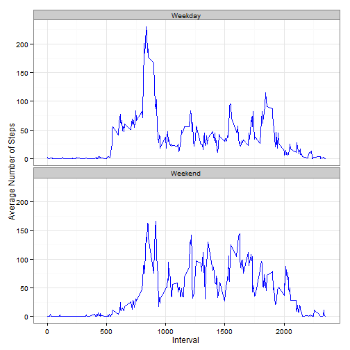

Reproducible Research: Peer Assessment 1
==========================================
## Loading and preprocessing the data

The code for loading dataset,required packages and preprocessing steps into R is

```r
activity <- read.csv("activity.csv")

suppressWarnings(library(lubridate))

suppressWarnings(library(ggplot2))

activity$day <- weekdays(as.Date(activity$date))

str(activity)
```

```
## 'data.frame':	17568 obs. of  4 variables:
##  $ steps   : int  NA NA NA NA NA NA NA NA NA NA ...
##  $ date    : Factor w/ 61 levels "2012-10-01","2012-10-02",..: 1 1 1 1 1 1 1 1 1 1 ...
##  $ interval: int  0 5 10 15 20 25 30 35 40 45 ...
##  $ day     : chr  "Monday" "Monday" "Monday" "Monday" ...
```


## What is mean total number of steps taken per day?

Histogram of the total number of steps taken each day is

```r
steps.date <- aggregate(activity$steps, by = list(activity$date), FUN = sum)

names(steps.date) <- c("date", "steps")

qplot(steps, data = steps.date, binwidth = 1400) + theme_bw()
```

 


Mean of total number of steps taken per day is

```r
mean(steps.date$steps, na.rm = T)
```

```
## [1] 10766
```


Median of total number of steps taken per day is


```r
median(steps.date$steps, na.rm = T)
```

```
## [1] 10765
```


## What is the average daily activity pattern?

Time series plot of the 5-minute interval (x-axis) and the average number of steps taken, averaged across all days (y-axis) is

```r
steps.interval <- aggregate(steps ~ interval, data = activity, FUN = mean, na.rm = T)

ggplot(steps.interval, aes(interval, steps)) + geom_line(color = "blue") + theme_bw() + 
    labs(x = "Interval", y = "Average Number of Steps")
```

 


The 5-minute interval, on average across all the days in the dataset that contains the maximum number of steps is


```r
steps.interval[which.max(steps.interval$steps), ]$interval
```

```
## [1] 835
```


## Imputing missing values

Total number of missing values in the dataset are


```r
sum(is.na(activity))
```

```
## [1] 2304
```


All the missing values in the dataset are filled with mean for that 5-minute interval. 


```r
a <- merge(activity, steps.interval, by = "interval", suffixes = c("", ".y"))

b <- is.na(a$steps)

a$steps[b] <- a$steps.y[b]
```


Create a new dataset that is equal to the original dataset but with the missing data filled in.

```r
a <- a[, c(-5)]

a <- a[order(a$date), ]

activity1 <- a
```


Histogram of the total number of steps taken each day with the new dataset is

```r
steps.date1 <- aggregate(activity1$steps, by = list(activity1$date), FUN = sum)

names(steps.date1) <- c("date", "steps")

qplot(steps, data = steps.date1, binwidth = 1400) + theme_bw()
```

 


Mean of total number of steps taken per day using the new dataset is


```r
mean(steps.date1$steps, na.rm = T)
```

```
## [1] 10766
```


Median of total number of steps taken per day using the new dataset is


```r
median(steps.date1$steps, na.rm = T)
```

```
## [1] 10766
```


By including the imputed values in the dataset, both the median and the mean total number of steps taken per day are equal, as expected. A comparison of histograms for the non-imputed and imputed datasets demonstrates that the imputation had the greatest impact on the 10,000 - 15,000 steps per day range and that the distribution of data with the imputed data appears to be more normal.

## Are there differences in activity patterns between weekdays and weekends?

Create a new factor variable in the dataset with two levels - "weekday" and "weekend" indicating whether a given date is a weekday or weekend day.


```r
activity1$daytype <- ifelse(activity1$day %in% c("Saturday", "Sunday"), "Weekend", 
    "Weekday")

activity1$daytype <- as.factor(activity1$daytype)
```


Make a panel plot containing a time series plot (i.e. type = "l") of the 5-minute interval (x-axis) and the average number of steps taken, averaged across all weekday days or weekend days (y-axis).


```r
steps.interval1 <- aggregate(steps ~ interval + daytype, data = activity1, FUN = mean, 
    na.rm = T)

ggplot(steps.interval1, aes(interval, steps)) + geom_line(color = "blue") + 
    theme_bw() + labs(x = "Interval", y = "Average Number of Steps") + facet_wrap(~daytype, 
    nrow = 2, ncol = 1)
```

 


In summary, there are several significant differences between the weekday and weekend profiles.

1)The weekend curve has a delayed onset perhaps related to late wake up time.

2)There is generally a higher degree of activities during the weekend than weekday.

3)There are also more activities towards the end of the day in weekend.
